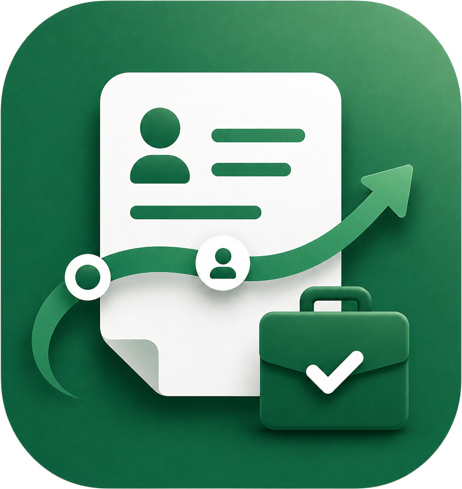
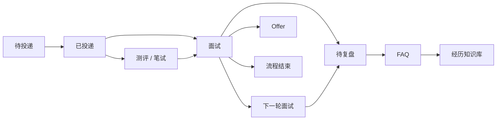

<p align="center">
  
</p>

<h1 align="center">OfferFlow</h1>

<p align="center">
  一站式个人求职流程管理工具
</p>

<p align="center">
  把散落在招聘网站、邮箱、日历、文件夹和备忘录里的求职信息，<br/>
  收拢成一条清晰、连续、可追踪的求职工作流。
</p>

<p align="center">
  
  
  
  
  
</p>

<p align="center">
  <a href="#-为什么做-offerflow">为什么做</a> ·
  <a href="#-核心功能">核心功能</a> ·
  <a href="#-快速开始">快速开始</a> ·
  <a href="#-技术栈">技术栈</a> ·
  <a href="#-项目文档">项目文档</a>
</p>

---

## 👋 什么是 OfferFlow？

OfferFlow 是一个面向个人求职场景的 **Job Search Management System**。

当投递数量逐渐增加后，一场求职通常会涉及：

- 不同公司的岗位 JD
- 多个简历版本
- 测评 / 笔试截止时间
- 多轮面试安排
- 面试录音与复盘
- 高频面试问题
- 项目经历与回答素材
- Offer、拒信和流程结束状态

这些信息往往散落在招聘官网、邮箱、手机日历、文件夹、备忘录和聊天记录中。

**OfferFlow 希望把它们组织成一个完整的求职上下文。**

它不只是记录「我投了哪些公司」，而是把：

```text
岗位
 ↓
JD ── 简历版本
 ↓
测评 / 笔试
 ↓
面试
 ↓
复盘
 ↓
FAQ
 ↓
经历知识库
```

真正关联起来。

---

## 💡 为什么做 OfferFlow？

普通 Excel 或 Kanban 可以记录求职状态，但随着流程变复杂，很快会遇到几个问题：

**信息分散**

JD 在官网，简历在文件夹，测评通知在邮箱，面试时间在日历，FAQ 又散落在多个文档中。

**上下文断裂**

收到面试邀请时，经常需要重新确认：

> 这是哪个岗位？  
> 当时投的是哪一版简历？  
> JD 写了什么？  
> 上一轮面试问过什么？

**待办容易遗漏**

测评截止时间、笔试、面试、复盘都需要单独记忆和维护。

**面试经验无法沉淀**

同一个项目可能被不同公司反复追问，但问题和回答很难形成持续更新的知识库。

因此 OfferFlow 的设计目标不是增加更多记录动作，而是：

> **用尽可能少的操作，把一次求职过程中产生的信息自动串联起来。**

---

## ✨ 核心功能

### 1. 求职流程管理

统一管理从「准备投递」到「流程结束」的完整生命周期。

支持：

- 待投递 / 已投递岗位
- JD 信息维护
- 简历版本关联
- 测评 / 笔试
- 面试安排
- 通用待办
- Offer / 拒信 / 主动结束
- 完整 Timeline

每个岗位都会持续保留自己的求职上下文，而不是只有一个简单的状态字段。

### 2. 工作台

首页聚合当前最值得关注的信息：

- 即将到期的任务
- 即将开始的面试
- 待复盘面试
- 长时间无进展岗位
- 当前流程状态
- 下一步行动

减少在多个页面之间反复查找信息。

### 3. 面试与日历

集中管理面试安排：

- 创建面试
- 面试改期
- 取消面试
- 时间冲突检测
- 周日历查看
- Transcript 上传
- 面试结束后的复盘闭环

让「面试安排」和「对应岗位」始终保持关联。

### 4. 简历与经历库

OfferFlow 将 **经历（Experience）** 作为长期复用的知识单元。

可以维护：

```text
公司 / 项目
  └── 经历
       ├── 简历版本
       └── FAQ
```

这样即使针对不同岗位使用不同简历版本，同一段项目经历积累的面试问题仍然可以持续复用。

### 5. FAQ 面试知识库

将每次面试中出现的问题沉淀为结构化 FAQ。

支持：

- 批量导入 FAQ
- 自动拆分问题
- 绑定项目经历
- 自定义分类
- 搜索与筛选
- 问题编辑与维护
- 来源面试追踪
- 高频问题统计
- 多次出现的问题合并

FAQ 不再属于某一份孤立的面试记录，而会逐渐形成个人长期维护的 **面试知识库**。

### 6. AI 相似问题识别

批量导入 FAQ 时，可以选择使用 AI 与历史问题进行相似度识别。

流程为：

```text
导入问题
   ↓
AI 匹配历史 FAQ
   ↓
人工复核
   ↓
保留 / 合并
   ↓
写入知识库
```

AI 只负责辅助识别，不会绕过用户直接修改正式 FAQ。

兼容 OpenAI Chat Completions API 风格的模型服务。

### 7. 全局快捷操作

通过全局快捷入口快速完成：

- 新增岗位
- 记录进展
- 创建待办
- 新增知识

减少「先找到页面 → 再找到入口 → 再执行操作」的路径成本。

### 8. 账号与数据安全

目前支持：

- 邮箱密码注册
- 邮箱验证
- 找回密码
- 数据库 Session
- 多用户数据隔离
- 私有文件存储
- 完整结构化 JSON 导出

简历、Transcript 等文件通过 S3 Compatible 私有对象存储管理。

---

## 🔄 求职工作流



OfferFlow 的核心不是维护一张岗位表，而是持续维护这条工作流中产生的上下文。

---

## 🧱 技术栈

| Layer | Technology |
| --- | --- |
| Framework | Next.js 16 |
| UI | React 19 |
| Language | TypeScript 5.9 |
| Styling | Tailwind CSS 4 |
| Database | PostgreSQL |
| ORM | Drizzle ORM |
| Authentication | Better Auth |
| Object Storage | MinIO / S3 Compatible Storage |
| AI | OpenAI Compatible Chat Completions API |
| Validation | Zod |
| Testing | Vitest |
| CI | GitHub Actions |
| Runtime | Node.js 22 |
| Package Manager | pnpm 11 |

---

## 🏗️ 项目结构

```text
OfferFlow
├── src
│   ├── app             # Next.js App Router / 页面与接口
│   ├── components      # UI Components
│   ├── modules         # 核心业务模块
│   ├── adapters        # 外部能力适配
│   ├── db              # Database / Schema
│   └── shared          # 通用能力
│
├── drizzle             # Database migrations
├── docs                # 产品与技术文档
├── scripts             # 本地服务、测试与维护脚本
├── compose.yaml        # PostgreSQL + MinIO
├── Dockerfile
└── README.md
```

核心业务动作通过统一的 Workflow 接口收敛，使 UI、自动化脚本以及未来 AI Agent 都能够复用同一套业务能力。

---

## 🚀 快速开始

### 环境要求

请先准备：

- Node.js 22
- pnpm 11.19+
- PostgreSQL
- MinIO / S3 Compatible Storage

克隆项目：

```bash
git clone https://github.com/chiki1234/OfferFlow.git
cd OfferFlow

pnpm install
```

复制环境变量：

```bash
cp .env.example .env.local
```

Windows PowerShell：

```powershell
Copy-Item .env.example .env.local
```

修改 `.env.local` 中的数据库、对象存储和认证配置。

### 方式一：Windows 本地便携服务

OfferFlow 提供 PostgreSQL + MinIO 本地服务脚本，不要求安装 Docker Desktop。

```powershell
pnpm services:setup
pnpm db:migrate
pnpm storage:ensure
```

创建本地账号：

```powershell
$env:INITIAL_USER_EMAIL="you@example.com"
$env:INITIAL_USER_NAME="你的名字"
$env:INITIAL_USER_PASSWORD="至少10位的安全密码"

pnpm auth:create-user
```

启动应用：

```powershell
pnpm dev
```

访问：

```text
http://localhost:3000
```

之后重新启动电脑，只需：

```powershell
pnpm services:start
pnpm dev
```

停止本地服务：

```powershell
pnpm services:stop
```

### 方式二：Docker

如果本机已经安装 Docker：

```bash
docker compose up -d
```

然后执行：

```bash
pnpm db:migrate
pnpm storage:ensure
pnpm dev
```

打开：

```text
http://localhost:3000
```

---

## 🔑 环境变量

完整配置参考：

```text
.env.example
```

主要配置包括：

```env
# Database
DATABASE_URL=

# Application
APP_URL=http://localhost:3000

# Authentication
AUTH_MODE=password
AUTH_SECRET=

# SMTP
SMTP_HOST=
SMTP_PORT=587
SMTP_USER=
SMTP_PASSWORD=
SMTP_FROM=

# Object Storage
S3_ENDPOINT=
S3_REGION=
S3_BUCKET=
S3_ACCESS_KEY=
S3_SECRET_KEY=

# AI — Optional
AI_BASE_URL=
AI_API_KEY=
AI_MODEL=
AI_TIMEOUT=120
AI_EXECUTOR=web
```

AI 配置不是运行 OfferFlow 基础功能的必要条件。

如果需要开放注册、邮箱验证和密码找回，则需要配置 SMTP。

> 不要在生产环境中继续使用 `.env.example` 中的示例密钥。

---

## 🤖 AI FAQ 配置

OfferFlow 的 AI 能力目前主要用于 **FAQ 相似问题识别**。

配置：

```env
AI_BASE_URL=https://api.openai.com/v1
AI_API_KEY=your-api-key
AI_MODEL=your-model
```

模型需要兼容 Chat Completions API，并支持 JSON Object 输出。

默认：

```env
AI_EXECUTOR=web
```

对于请求结束后可能冻结进程，或存在较严格执行时间限制的生产平台，建议使用独立 Worker：

```env
AI_EXECUTOR=worker
```

并运行：

```bash
pnpm ai:worker
```

AI 分析结果需要经过人工复核后才会进入正式 FAQ 数据。

---

## 🧪 开发与测试

常用命令：

| Command | Description |
| --- | --- |
| `pnpm dev` | 启动开发环境 |
| `pnpm build` | Production Build |
| `pnpm lint` | ESLint 检查 |
| `pnpm typecheck` | TypeScript 类型检查 |
| `pnpm test` | 单元测试 |
| `pnpm test:integration` | 核心业务集成测试 |
| `pnpm test:faq-ai` | FAQ AI 流程测试 |
| `pnpm test:auth` | 认证流程测试 |
| `pnpm db:generate` | 生成 Drizzle Migration |
| `pnpm db:migrate` | 执行数据库 Migration |
| `pnpm storage:ensure` | 初始化对象存储 Bucket |
| `pnpm ai:worker` | 启动 FAQ AI Worker |

提交代码前建议至少执行：

```bash
pnpm lint
pnpm typecheck
pnpm test
pnpm build
```

GitHub Actions 同样会持续运行相关质量检查。

---

## 📚 项目文档

仓库中保留了 OfferFlow 从需求分析到工程落地的完整过程。

| Document | Description |
| --- | --- |
| [`docs/需求痛点.md`](./docs/需求痛点.md) | 求职场景、用户痛点与需求分析 |
| [`docs/技术方案V1.md`](./docs/技术方案V1.md) | 系统架构与技术方案 |
| [`docs/一期验收清单.md`](./docs/一期验收清单.md) | V1 功能验收标准 |
| [`docs/迭代记录.md`](./docs/迭代记录.md) | 产品与工程迭代记录 |
| [`docs/adr`](./docs/adr) | Architecture Decision Records |

---

## 🗺️ Roadmap

### V1 — 求职流程基础设施

- [x] 岗位与 JD 管理
- [x] 简历版本管理
- [x] 测评 / 笔试管理
- [x] 面试与日历
- [x] Timeline
- [x] 待办系统
- [x] 经历库
- [x] FAQ 知识库
- [x] FAQ AI 相似识别
- [x] 多用户认证
- [x] 私有文件存储
- [x] 数据导出
- [x] CI / Integration Tests

### Next — AI Native OfferFlow

未来希望让 AI 不只是分析 FAQ，而是成为整个 OfferFlow 的统一操作入口：

```text
“帮我记录刚收到的字节二面，
下周三下午 3 点，
顺便创建一个面试准备任务。”
```

AI 可以理解用户意图，并调用 OfferFlow 已有业务能力完成查询、新增、修改和关联，让求职管理逐渐从：

**手动维护系统**

变成：

**和 AI 对话，系统自动维护。**

---

## 🤝 Contributing

OfferFlow 仍在持续迭代。

如果你也遇到类似的求职管理问题，欢迎通过：

- Issue 提交 Bug
- Issue 提出 Feature Request
- Pull Request 参与开发

一起完善这个项目。

---

<p align="center">
  <b>OfferFlow</b><br/>
  Keep every opportunity in flow.
</p>
