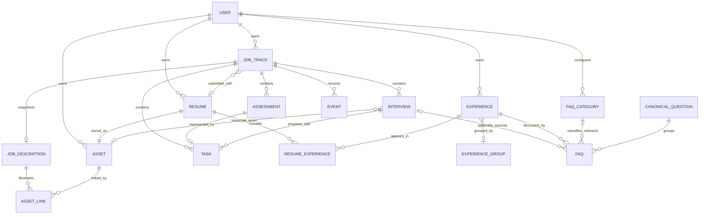

# 求职全流程管理 Web 技术方案 V1

状态：Implemented（按 2026-09-02 当前代码回写）
对应产品方案：V1.1  
目标：为 Release A 与 Release B 提供可以直接进入实现的架构、数据和验收约束。

## 1. 实现目标

一期技术实现优先保证：

1. 同一现实对象只保存一份，工作台、求职、日历和 FAQ 只是不同读取视图。
2. UI 每次提交一个完整业务意图，不由页面自行拼接多表 CRUD。
3. Event 只记录已确认事实，时间到达产生的状态在读取时推导。
4. UI 与未来 AI Assistant 共用相同业务动作。
5. Release A、Release B 按纵向业务闭环交付，不先建设一套脱离场景的通用后台。

一期明确不采用：微服务、消息队列、独立日历数据源、完整 Event Sourcing、复杂流程引擎、固定招聘状态机和 Elasticsearch。

## 2. 已解决的产品模型问题

### 2.1 增加 Assessment

产品方案同时存在 Deadline 型测评和固定时段笔试，但原核心模型没有能够稳定承载固定时段信息的对象。增加 `Assessment`，统一表示测评和笔试；Task 只表示用户行动，Calendar 只提供时间视图。

### 2.2 生命周期不能只依赖 submitted_at

极速建档允许“已投递但不知道准确投递时间”。因此 `JobTrack.lifecycle` 保存为业务事实：

- `planned`：待投递
- `active`：已进入招聘流程
- `ended`：已结束

`submitted_at` 仍可为空。正常投递必须填写，只有极速建档允许 active 且缺失该时间。

### 2.3 面试必须有结束时间

周日历和冲突检测需要时间区间。Interview 保存 `start_at` 与 `end_at`；创建时可默认 60 分钟，但用户能够修改。

### 2.4 FAQ 出现次数延期

一期没有母问题归并流程时，单条 FAQ 的出现次数没有稳定语义。Release B 只展示来源面试；完成 CanonicalQuestion 归并后再展示聚合出现次数。

## 3. 技术架构

```text
Browser
  |
  |-- Server Components --------> WorkspaceQueries.read(query)
  |                            `-> Knowledge/Resume query services
  |
  `-- Server Actions -----------> JobWorkflow.execute(command)
                               `-> Knowledge/Resume/Asset services
                                                |
                                  PostgreSQL transactions
                                    |           |
                                 write model   Event timeline
                                    |
                             S3-compatible storage
```

当前技术栈：

- Next.js 16 App Router、React 19、TypeScript 5
- PostgreSQL、Drizzle ORM 与 SQL migrations
- Tailwind CSS 4、Lucide React
- Zod 4
- Better Auth（邮箱密码、数据库会话、关闭公开注册）
- S3 兼容对象存储；本地可使用 MinIO
- Vitest 单元测试与真实 PostgreSQL/MinIO 集成烟测
- Windows 项目内便携服务；Docker Compose 作为可选本地环境

所有页面写入 adapter 必须完成认证、输入解析和错误映射，但不得包含领域规则。领域规则集中在 module implementation 中。

## 4. Module 与 interface

### 4.1 JobWorkflow

负责求职推进、测评、面试、待办和招聘事实的一致变更。

```ts
interface JobWorkflow {
  execute(command: JobCommand, context: ActorContext): Promise<JobCommandResult>;
}
```

Interface 保证：

- 一个命令在一个数据库事务中完成。
- 每个命令必须带 `idempotencyKey`。
- 重放成功过的同一命令返回原结果，不重复创建 Event。
- 不属于当前用户的对象表现为 `NOT_FOUND`，不泄漏其存在性。
- 返回调用后可观察到的对象标识和必要视图，不暴露内部表写入步骤。

### 4.2 Interview Knowledge services

知识模块当前采用显式 service function，而不是统一的 `execute` interface。它负责 Experience CRUD、Resume ↔ Experience 关联、FAQ Block 解析/批量入库、FAQ 编辑删除，以及未绑定 FAQ 分类管理。`parseFaqBlocks` 只解析不写库；`commitFaqBatch` 在用户逐条确认绑定状态后以事务写入，并可选关联来源 Interview。

### 4.3 WorkspaceQueries

负责面向页面的读取模型，隐藏多表连接和状态推导。

```ts
interface WorkspaceQueries {
  read(query: WorkspaceQuery, context: ActorContext): Promise<WorkspaceView>;
}
```

`WorkspaceQueries` 当前 Query：

- `get_dashboard`
- `list_job_tracks`
- `get_job_track_detail`
- `get_calendar_week`

面试知识读取由 `getKnowledgeLibrary`、`getExperienceDetail`、`getInterviewKnowledgeDetail` 和 `getFaqCategoryConfig` 提供；Resume 选项与全局快捷操作选项也通过独立 query service 组合。

## 5. 数据模型

### 5.1 ERD



### 5.2 核心字段

#### users / sessions / accounts

`users` 保存账号资料和时区；`sessions`、`accounts`、`verifications` 由 Better Auth 承载密码账号和数据库会话。公开注册关闭，管理员通过 `pnpm auth:create-user` 创建账号。所有业务表查询均以当前 `user_id` 隔离，不属于当前用户的对象统一表现为不存在。

#### job_tracks

```text
id                  uuid primary key
user_id             uuid not null
company_name        varchar not null
role_name           varchar not null
job_url             text null
lifecycle           planned | active | ended
submitted_at        timestamptz null
resume_id           uuid null
ended_at            timestamptz null
end_reason          rejected | withdrawn | inactive | other | null
created_via         normal | quick_import
created_at          timestamptz not null
updated_at          timestamptz not null
version             integer not null
```

不对公司与岗位名称建立业务唯一约束。`version` 用于乐观并发控制。

#### job_descriptions

```text
id                  uuid primary key
job_track_id        uuid unique not null
text_content        text null
created_at          timestamptz not null
updated_at          timestamptz not null
```

JD 图片通过 `asset_links(owner_type=job_description)` 关联。文本和图片至少存在一种，极速建档除外。

#### asset_links

```text
id                  uuid primary key
asset_id            uuid not null
owner_type          job_description
owner_id            uuid not null
sort_order          integer not null
created_at          timestamptz not null
```

一期仅用它关联一份 JD 的多张截图；Resume 与 Transcript 使用明确外键，不经过多态关联。

#### assets

```text
id                  uuid primary key
user_id             uuid not null
kind                jd_image | resume | transcript
storage_key         text unique not null
original_name       text not null
mime_type           varchar not null
size_bytes          integer not null
sha256              char(64) null
created_at          timestamptz not null
```

对象默认私有，客户端只获得短时效上传或下载 URL。

#### resumes

```text
id                  uuid primary key
user_id             uuid not null
name                varchar not null
asset_id            uuid unique not null
created_at          timestamptz not null
```

Resume 不进行就地文件替换；新文件创建新 Resume。

#### experiences / experience_groups

```text
experiences:
  id, user_id, group_id?, name, content, created_at, updated_at

experience_groups:
  id, user_id, name, sort_order, created_at

resume_experiences:
  resume_id, experience_id, sort_order
```

`resume_experiences` 以 `(resume_id, experience_id)` 为联合主键。

#### assessments

```text
id                  uuid primary key
job_track_id        uuid not null
kind                assessment | written_test
title               varchar not null
timing_type         deadline | fixed_slot
deadline_at         timestamptz null
start_at            timestamptz null
end_at              timestamptz null
status              pending | completed | cancelled
completed_at        timestamptz null
cancelled_at        timestamptz null
notes               text null
created_at          timestamptz not null
updated_at          timestamptz not null
```

约束：deadline 型必须有 `deadline_at`；fixed_slot 型必须有合法的 `start_at < end_at`。

#### interviews

```text
id                  uuid primary key
job_track_id        uuid not null
sequence_no         integer null
round_label         varchar not null
interview_type      varchar not null
start_at            timestamptz not null
end_at              timestamptz not null
meeting_url         text null
notes               text null
status              scheduled | cancelled
cancelled_at        timestamptz null
occurred_at         timestamptz null
reviewed_at         timestamptz null
transcript_text     text null
transcript_asset_id uuid null
created_at          timestamptz not null
updated_at          timestamptz not null
version             integer not null
```

`round_label` 使用文本以容纳“一面”“加面”“HR 沟通”等非标准轮次；`sequence_no` 仅用于排序。

#### tasks

```text
id                  uuid primary key
user_id             uuid not null
job_track_id        uuid null
interview_id        uuid null
assessment_id       uuid null unique
kind                generic | interview_prep | assessment
title               varchar not null
deadline_at         timestamptz null
completed_at        timestamptz null
cancelled_at        timestamptz null
created_at          timestamptz not null
updated_at          timestamptz not null
```

Assessment 生成的 Task 必须通过 `complete_assessment` 完成，保证 Assessment、Task 和 Event 同步。

#### events

```text
id                  uuid primary key
user_id             uuid not null
job_track_id        uuid not null
kind                varchar not null
subject_type        job_track | assessment | interview | task
subject_id          uuid not null
occurred_at         timestamptz not null
recorded_at         timestamptz not null
action_id           uuid not null
payload             jsonb not null default '{}'
```

Event 只追加，不提供通用 update/delete。`(user_id, action_id, kind, subject_id)` 建立唯一约束。

#### faqs

```text
id                    uuid primary key
user_id               uuid not null
source_interview_id   uuid not null
kind                  experience | general (由绑定状态派生)
question              text not null
answer                text not null
experience_id         uuid null
category               varchar null
canonical_question_id uuid null
created_at             timestamptz not null
updated_at             timestamptz not null
```

约束：`source_interview_id` 可为空，FAQ 可从面试复盘导入，也可独立录入。用户不直接配置 `kind`，而是逐条必选是否绑定经历。绑定时必须有 `experience_id`、`category` 必须为空，并自动派生 `kind=experience`；未绑定时 `experience_id` 必须为空、分类可选，并自动派生 `kind=general`。只有未绑定且分类为空的 FAQ 标记为待完善。有关联面试时，JobTrack 通过 source Interview 推导，不在 FAQ 中重复保存。

#### faq_categories

```text
id                  uuid primary key
user_id             uuid not null
kind                experience | general
name                varchar(64) not null
sort_order          integer not null
deleted_at          timestamptz null
created_at          timestamptz not null
updated_at          timestamptz not null
```

当前只使用 `kind=general` 管理未绑定 FAQ 的分类。首次使用会按需写入默认分类；重命名在事务中同步历史 FAQ，软删除分类时把历史 FAQ 的 `category` 清空，使其进入待补充状态。`(user_id, kind, name)` 唯一。

### 5.3 首批索引

```text
job_tracks(user_id, lifecycle, updated_at desc)
assessments(job_track_id, status, deadline_at)
interviews(job_track_id, status, start_at)
tasks(user_id, completed_at, deadline_at)
events(job_track_id, occurred_at desc, recorded_at desc)
faqs(user_id, kind, category)
faqs(experience_id, created_at)
faqs(source_interview_id)
faq_categories(user_id, kind, name) unique
faq_categories(user_id, kind, sort_order)
```

一期数据量下 FAQ 搜索先使用 PostgreSQL `ILIKE`；确认规模和中文分词需求后再决定全文检索方案。

## 6. 状态推导

状态函数必须显式接收 `now` 和 `userTimezone`，测试不能读取隐藏的系统时间。

```ts
deriveJobTrackView(facts: JobTrackFacts, now: Instant): JobTrackStatusView
```

### 6.1 当前行动状态

| 条件 | ActionState |
|---|---|
| lifecycle 不是 active | `null` |
| 存在未完成且未取消的 Assessment | `action_required` |
| 存在未来 scheduled Interview | `action_required` |
| 存在有效、未完成且未取消的用户 Task | `action_required` |
| 以上均不存在 | `waiting` |

Interview 时间到达后不再使 JobTrack 保持 `action_required`；JobTrack 进入 `waiting`，而 Interview 同时进入 `review_due` 待复盘状态。

“有效用户 Task”不包含 Assessment 自动生成的 Task，也不包含已经到时或取消的 Interview 所关联的准备 Task；前者由 Assessment 自身决定状态，后者保留在历史中但不阻止 JobTrack 进入 waiting。

### 6.2 关注标记

| 标记 | 推导条件 |
|---|---|
| `overdue` | 未完成 Task 或 Assessment 的 deadline 早于 now |
| `waiting_long` | ActionState 为 waiting，且满足下述等待锚点规则 |

等待较久规则：

- 最近等待锚点为面试时间或实际发生时间：超过 7 天。
- 最近等待锚点为测评完成时间：超过 14 天。
- 仅完成投递但没有后续环节：Release A 暂不提示等待较久。

阈值是代码中的产品配置，不开放用户自定义。

### 6.3 待复盘推导

Interview 未取消、`start_at` 不晚于 now 且 `reviewed_at` 为空时，推导为 `review_due`。它由工作台单独聚合，不属于 JobTrack 的 AttentionFlag，也不证明面试已经实际发生。

### 6.4 面试事实确认

以下动作会在尚未确认时自动确认 Interview 已发生，并生成一次 `InterviewOccurred`：

- 主动 `confirm_interview_occurred`
- 提交该面试 FAQ
- 保存该面试 Transcript
- 完成该面试复盘

仅时间到达不会创建该 Event。

## 7. Domain Commands

### 7.1 JobTrack

| Command | 关键输入 | 主要结果 |
|---|---|---|
| `create_job_track` | company、role、JD、url? | 创建 planned JobTrack |
| `quick_import_job_tracks` | 多行 company、role、lifecycle | 批量创建允许缺资料的 JobTrack |
| `update_job_track_context` | jobTrackId、可修改字段、version | 更新岗位上下文 |
| `delete_planned_job_track` | jobTrackId | 仅删除未投递 JobTrack |
| `submit_application` | jobTrackId、resumeId、submittedAt | 进入 active 并创建 ApplicationSubmitted |
| `record_rejection` | jobTrackId、occurredAt、notes? | 结束推进并创建 RejectionReceived |
| `end_job_track` | jobTrackId、reason、occurredAt | 主动结束并创建 JobTrackEnded |
| `record_generic_progress` | jobTrackId、summary、occurredAt | 创建只读 GenericProgress |

正常 `submit_application` 要求 JD 和 Resume 完整；极速建档通过专用命令进入 active，不伪造准确投递时间。

### 7.2 Assessment

| Command | 主要联动 |
|---|---|
| `record_assessment_invite` | 创建 Assessment；deadline 型同时创建 Task；创建 AssessmentInvited |
| `complete_assessment` | 完成 Assessment 和关联 Task；创建 AssessmentCompleted |
| `cancel_assessment` | 取消 Assessment 和关联 Task；创建 AssessmentCancelled |

### 7.3 Interview

| Command | 主要联动 |
|---|---|
| `schedule_interview` | 创建 Interview；创建 InterviewInvited |
| `reschedule_interview` | 修改时间；创建 InterviewRescheduled，payload 保存前后时间 |
| `cancel_interview` | 取消 Interview；取消系统生成的准备 Task；创建 InterviewCancelled |
| `confirm_interview_occurred` | 设置 occurred_at；幂等创建 InterviewOccurred |
| `complete_interview_review` | 必要时确认发生；设置 reviewed_at；创建 InterviewReviewed |
| `save_interview_transcript` | 必要时确认发生；保存文本或文件引用 |

### 7.4 Task

| Command | 主要联动 |
|---|---|
| `create_task` | 创建通用或面试准备 Task |
| `update_task` | 修改标题、Deadline 或关联 |
| `complete_task` | 完成普通 Task；Assessment Task 必须转交 complete_assessment |
| `cancel_task` | 取消普通 Task |

### 7.5 Knowledge

| Command | 主要联动 |
|---|---|
| `parse_faq_blocks` | 按 `---` 拆分并逐 Block 返回解析结果，不写库 |
| `commit_faq_batch` | 校验分类和 Experience；必要时确认面试发生；批量写入 FAQ |
| `update_faq` | 修改问题、答案、分类和 Experience |
| `delete_faq` | 删除误录 FAQ，不删除来源 Interview Event |

## 8. 错误模型

Module interface 只暴露稳定错误码：

```text
VALIDATION_ERROR       输入不符合业务规则
NOT_FOUND              对象不存在或用户不可访问
CONFLICT               version 过期或对象状态不允许动作
IDEMPOTENT_REPLAY      同一动作已执行，携带原结果
STORAGE_NOT_READY      文件尚未完成上传确认
INTERNAL_ERROR         未预期错误，仅记录内部详情
```

页面使用错误码生成用户可理解的提示，不直接展示数据库或存储错误。

## 9. 页面路由

| 路由 | 页面 | 主要 Query/Command |
|---|---|---|
| `/` | 工作台 | get_dashboard |
| `/jobs` | 待投递/进行中/已结束 | list_job_tracks |
| `/jobs/[id]` | 岗位详情与 Timeline | get_job_track_detail |
| `/calendar` | 周日历 | get_calendar_week |
| `/faq` | 问题/经历视图 | search_faqs、list_experiences |
| `/experiences/[id]` | 经历详情 | get_experience_detail |
| `/interviews/[id]` | 面试准备与复盘 | get_interview_detail |

全局快捷操作使用 modal/bottom sheet，不引入独立一级页面。移动端优先保留底部一级导航，桌面端可使用侧边导航，但路由和读取模型一致。

## 10. Calendar Read Model

Calendar 不建业务表。`get_calendar_week` 合并：

```text
Interview.start_at/end_at
Assessment.start_at/end_at       # fixed_slot
Assessment.deadline_at           # deadline
Task.deadline_at
```

每个 Calendar item 返回 `sourceType + sourceId`，点击后回到真实业务对象。冲突只对具有开始和结束时间的硬时段计算；Deadline 提示不参与时段重叠判断。

## 11. 文件与安全

1. 所有业务查询和命令都以认证后的 `userId` 限定数据。
2. Server Action 与 Route Handler 均视作公开入口，不能依赖页面隐藏按钮实现授权。
3. 文件上传前校验类型和大小，上传后确认对象存在再创建业务关联。
4. Resume、JD 图片和 Transcript 默认私有，通过短时效 URL 访问。
5. 日志不得记录简历内容、Transcript 正文、预签名 URL 或认证令牌。
6. 数据库备份与对象存储生命周期策略在生产部署前完成演练。

## 12. 测试策略

测试穿过 module interface，断言可观察结果，不围绕内部 repository 方法编写大量 mock 测试。

### 12.1 JobWorkflow 场景

1. 正常投递一次创建一个 Event；同一 idempotencyKey 重试不重复。
2. 正常投递缺 JD 或 Resume 时拒绝；极速建档允许缺失。
3. 完成测评同时完成关联 Task 并进入 waiting。
4. 面试时间到达只推导 review_due，不生成 InterviewOccurred。
5. 首次提交 FAQ 自动确认面试发生；重复提交不重复产生发生 Event。
6. 改期保留同一个 Interview，并记录前后时间。
7. planned JobTrack 可以删除；active JobTrack 不能硬删除。
8. 用户不能通过猜测 ID 读取或修改其他用户对象。
9. 乐观锁冲突返回 CONFLICT，不覆盖较新的编辑。
10. 不同时区下今日 Deadline 和周日历日期正确。

### 12.2 FAQ 解析场景

1. 多行答案保留换行。
2. 单个损坏 Block 不阻止其他 Block 解析。
3. 每条待导入 FAQ 必须明确选择是否绑定经历，未选择时不能提交。
4. 选择绑定时必须选择 Experience，且不再设置分类。
5. 选择不绑定时不允许携带 Experience，分类可以为空；为空时导入后标记待完善。
6. 批量提交要么全部写入，要么全部回滚。

### 12.3 E2E 最小闭环

```text
新增待投递
→ 保存 JD
→ 上传并绑定 Resume
→ 标记已投递
→ 收到 Deadline 型测评
→ 完成测评
→ 收到面试邀约
→ 日历出现面试
→ 时间到达后工作台出现待复盘
→ 批量录入 FAQ
→ Experience 页面可查到问题
```

## 13. 代码目录

```text
src/
├── app/                              # 页面和 adapter
├── modules/
│   ├── job-workflow/
│   │   ├── interface.ts
│   │   ├── implementation.ts
│   │   ├── commands/
│   │   ├── status-rules.ts
│   │   └── errors.ts
│   ├── interview-knowledge/
│   │   ├── interface.ts
│   │   ├── implementation.ts
│   │   └── faq-parser.ts
│   └── workspace-queries/
│       ├── interface.ts
│       └── implementation.ts
├── adapters/
│   ├── database/
│   ├── storage/
│   └── auth/
├── db/
│   ├── schema/
│   └── migrations/
└── shared/
    ├── clock/
    ├── ids/
    ├── result/
    └── validation/

tests/
├── integration/
└── e2e/
```

`app/` 不导入数据库表进行写入，只调用 module interface。读页面同样优先调用 WorkspaceQueries，避免把复杂状态拼装散落在多个 page 中。

## 14. 交付切片

### M0：工程基础

- Git、Next.js、TypeScript、lint/format/test
- PostgreSQL、migration、认证、用户时区
- 对象存储上传闭环
- CI 构建与测试

验收：新环境可通过一条文档化命令启动，migration 可重复执行。

### M1：投递闭环

- JobTrack、JD、Resume
- 新增待投递、极速建档、标记已投递
- Timeline 与岗位三个 Tab

验收：完成产品方案中“新增待投递 → 标记已投递 → 等待”的完整路径。

### M2：测评与待办闭环

- Assessment、Task
- Deadline 与 fixed slot
- 完成、取消、逾期推导

验收：一次完成操作同时更新 Assessment、Task、Timeline 和岗位视图。

### M3：面试与日历闭环

- Interview 创建、改期、取消、实际发生确认
- 周日历与冲突提示
- 时间到达后的 waiting 与 review_due 推导

验收：修改 Interview 时间后所有页面从同一对象读取新时间。

### M4：行动工作台

- 今天要做、近期日程、需要关注
- 排序规则与时区测试
- 冷启动批量极速建档

验收：用户无需维护额外状态即可看到正确的下一步。

### M5：面试知识闭环

- Experience 与 Resume 关联
- FAQ Block 解析和批量确认
- 问题/经历视图

验收：从一次 Interview 录入的 FAQ 能通过 Resume → Experience 在下一次准备中找到。

## 15. 开工前确认项

以下问题会影响初始化配置，但不改变本方案的核心模型：

1. 首次部署面向单用户自用还是公开注册。
2. 生产部署区域和对象存储供应商。
3. 登录方式使用邮箱验证码、密码还是第三方 OAuth。
4. Resume 与 Transcript 的单文件大小上限。

默认实现假设：界面和数据模型支持多用户，但首个部署只开放邀请注册；默认时区为 Asia/Shanghai；文件保持私有。
